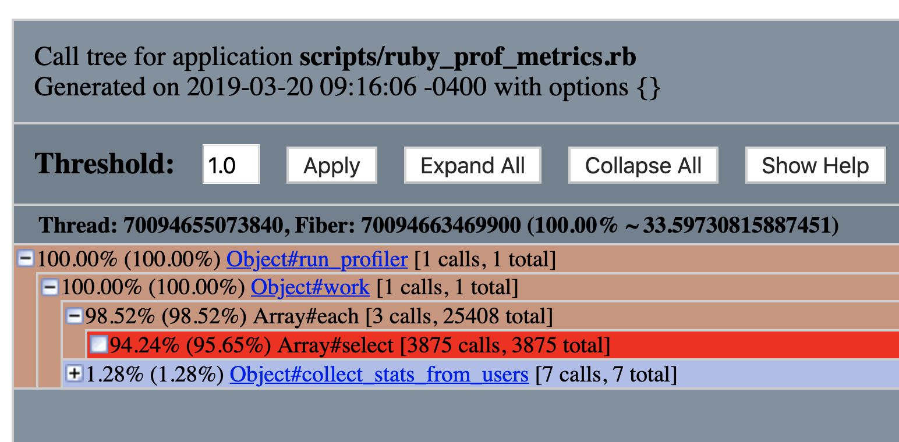
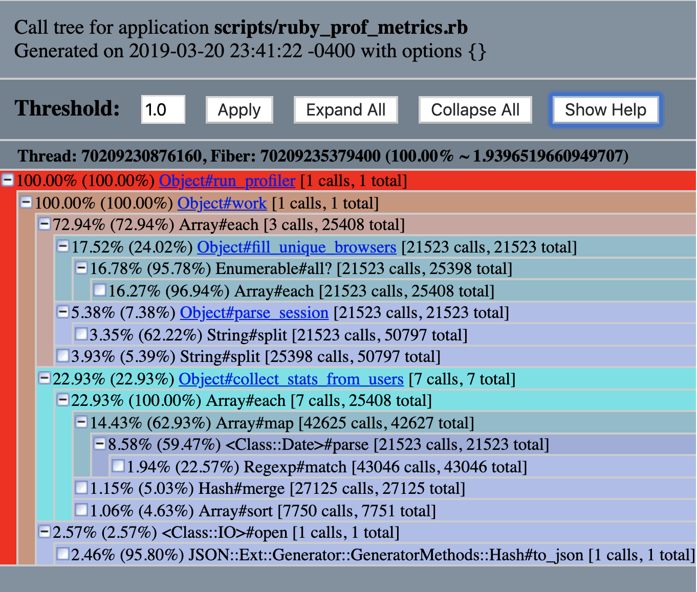
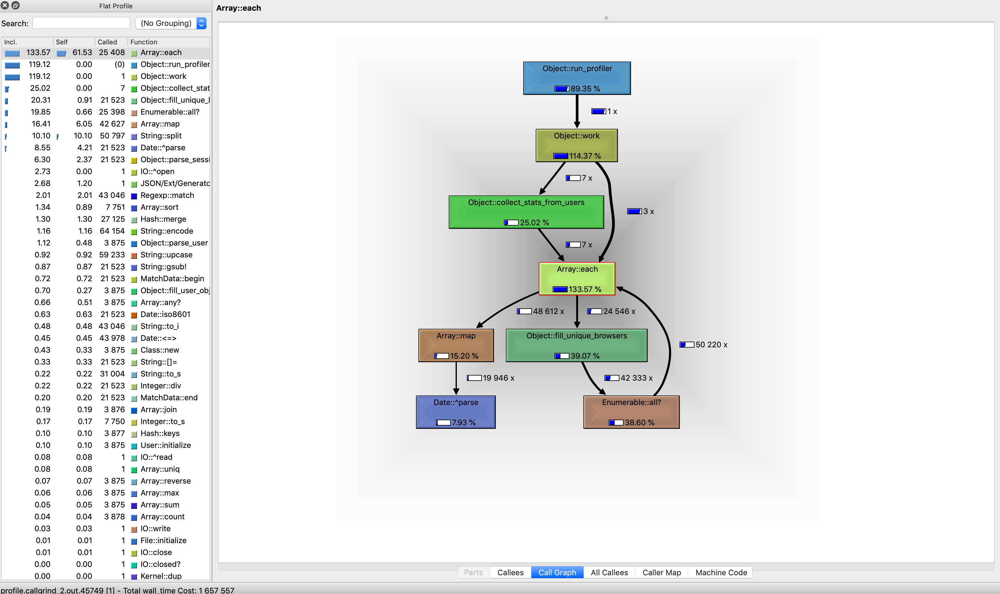
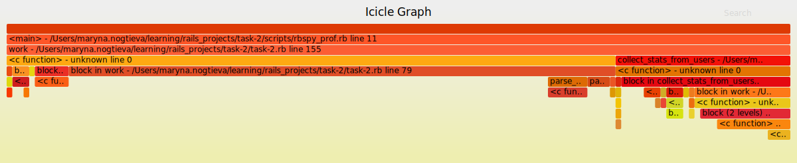

# Case-study оптимизации

## Актуальная проблема
В нашем проекте возникла серьёзная проблема.

Необходимо было обработать файл с данными, чуть больше ста мегабайт.

У нас уже была программа на `ruby`, которая умела делать нужную обработку.

Она успешно работала на файлах размером пару мегабайт, но для большого файла она работала слишком долго, и не было понятно, закончит ли она вообще работу за какое-то разумное время.

Я решил исправить эту проблему, оптимизировав эту программу.

## Формирование метрики
Для того, чтобы понимать, дают ли мои изменения положительный эффект на быстродействие программы я придумал использовать такую метрику: Amount of iterations per second in files of different sizes.

## Анализ зависимости метрики от входных данных
In order to track metrics dependency on the amount of data, we will use script that checks this metrics in differents
files, where files sizes are: 0.25MB, o.5MB and 1MB.
For measuring this metric we will use `scripts/asymptotics.rb` script.

We will use benchmark and benchmark/ips

Results of these measurments for `benchmark/ips` (iterations per seconds) are the following:

```
Calculating -------------------------------------
      Process 0.25Mb      1.145  (± 0.0%) i/s -      6.000  in   5.240788s
       Process 0.5Mb      0.291  (± 0.0%) i/s -      2.000  in   6.891300s
         Process 1Mb      0.039  (± 0.0%) i/s -      1.000  in  25.659316s

Comparison:
      Process 0.25Mb:        1.1 i/s
       Process 0.5Mb:        0.3 i/s - 3.94x  slower
         Process 1Mb:        0.0 i/s - 29.38x  slower
```

As we can see from the above calculations the when we iterate the file of 0.5MB, we receive almost 4 times slower iterations per seconds metric comparing to the 0.25MB size file. Processing 1MB file is approximately 29 times slower. Therefore, we can observe that increasing file size in 2 times, will cause dramatic increase in processing time.

Results of these measurments using `Benchmark.realtime` are the following:

```
data/data_025mb.txt
Finish in 0.85
data/data_05mb.txt
Finish in 4.8
data/data_1mb.txt
Finish in 27.48
```

## Initial metrics
I decided to work with 1MB file where initial i/s is 0.039 and realtime processint is approximately 27 seconds.


## Гарантия корректности работы оптимизированной программы
Программа поставлялась с тестом. Выполнение этого теста позволяет не допустить изменения логики программы при оптимизации.

## Feedback-Loop
Для того, чтобы иметь возможность быстро проверять гипотезы я выстроил эффективный `feedback-loop`, который позволил мне получать обратную связь по эффективности сделанных изменений за *время, которое у вас получилось*

Вот как я построил `feedback_loop`:


1. Create a relatively small file(1 MB)
2. Make a code change
3. Check if the change passes in the code
4. If the test passes, check if the metrics have metrics
5. If the test does not read, see item 1.
6. If metrics are acceptable, push to GitHub

## Вникаем в детали системы, чтобы найти 20% точек роста
Для того, чтобы найти "точки роста" для оптимизации я воспользовался *инструментами, которыми вы воспользовались*
- benchmark and benchmark/ips
- ruby-prof gem (`RubyProf::Flat`), `WALL_TIME` 
- ruby-prof gem (`GraphHtmlPrinter`), `WALL_TIME`

## Initial Measurements

Вот какие проблемы удалось найти и решить:

From `RubyProf::Flat` report, we can identify 2 main problems:
```
%self      total      self      wait     child     calls  name
 94.07     29.643    29.643     0.000     0.000     3875   Array#select

  2.98     31.432     0.938     0.000    30.494    25408  *Array#each
```
 %self - The percentage of time spent in this method, derived from self_time/total_time
  total - The time spent in this method and its children.
  self  - The time spent in this method.
  wait  - amount of time this method waited for other threads
  child - The time spent in this method's children.
  calls - The number of times this method was called.
  name  - The name of the method.

We can see that `#select` method on array is calld 3875 times and time spent in this method is 29.6
On the other hand, `#each` method is called 25408 time and most of the time is spent in this method's children.

Based on the `GraphHtmlPrinter` report we observe same results, 
where starting from line 100 there is a memory consuming code:

```
users.each do |user|
  attributes = user
  user_sessions = sessions.select { |session| session['user_id'] == user['id'] }
  user_object = User.new(attributes: attributes, sessions: user_sessions)
  users_objects = users_objects + [user_object]
end
```


Based on the screenshot from `CallStackPrinter`, we can see that `select` is our method to look at


### Ваша находка №1
In order to retreive all sessions for user it was decided to create a `user_sessions` hash right during the reading of the file with keys equal to `user_id` and value equal to the array of sessions corresponding to each user.

```
file_lines.each do |line|
  cols = line.split(',')
  
  users << parse_user(line) if cols[0] == 'user'
  next unless cols[0] == 'session'
  session = parse_session(line) 
  sessions = sessions + [session] 
  user_sessions[session['user_id']] ||= []
  user_sessions[session['user_id']] << session
end
```

Results of these measurments for `benchmark/ips` (iterations per seconds) are the following:
```
Calculating -------------------------------------
      Process 0.25Mb      4.979  (± 0.0%) i/s -     25.000  in   5.070887s
       Process 0.5Mb      2.064  (± 0.0%) i/s -     11.000  in   5.383638s
         Process 1Mb      0.696  (± 0.0%) i/s -      4.000  in   5.755144s

Comparison:
      Process 0.25Mb:        5.0 i/s
       Process 0.5Mb:        2.1 i/s - 2.41x  slower
         Process 1Mb:        0.7 i/s - 7.15x  slower
```

Results of these measurments using `Benchmark.realtime` are the following:
```

data/data_025mb.txt
Finish in 0.2
data/data_05mb.txt
Finish in 0.51
data/data_1mb.txt
Finish in 1.62
```

Just based on the above reports we can see that processing file was much faster after this refactoring.

#### Redults from RubyProf::FlatProfiler
Main work is happening in the following methods:
- `Array#each from collect_stats_from_users`
- ` String#split` from `Object#parse_user` and `Object#parse_session`
- `Array#map` from many places in `Object#work`
- `<Class::Date>#parse`
- `Object#parse_session` where `split(',')` method is executed
- `Regexp#match`
- `Hash#to_json`
- `Hash#merge`
```
 %self      total      self      wait     child     calls  name
 50.75      1.831     0.970     0.000     0.861    25408  *Array#each
    called from:
      Object#work (txmt://open?url=file:///Users/maryna.nogtieva/learning/rails_projects/task-2/task-2.rb&line=61)
      Object#collect_stats_from_users (txmt://open?url=file:///Users/maryna.nogtieva/learning/rails_projects/task-2/task-2.rb&line=39)

  8.23      0.157     0.157     0.000     0.000    50797   String#split
    called from:
      Object#work (txmt://open?url=file:///Users/maryna.nogtieva/learning/rails_projects/task-2/task-2.rb&line=61)
      Object#parse_user (txmt://open?url=file:///Users/maryna.nogtieva/learning/rails_projects/task-2/task-2.rb&line=18)
      Object#parse_session (txmt://open?url=file:///Users/maryna.nogtieva/learning/rails_projects/task-2/task-2.rb&line=28)

  5.24      0.282     0.100     0.000     0.182    42627   Array#map
    called from:
      Object#work (txmt://open?url=file:///Users/maryna.nogtieva/learning/rails_projects/task-2/task-2.rb&line=61)

  4.04      0.152     0.077     0.000     0.075    21523   <Class::Date>#parse

  1.86      0.090     0.036     0.000     0.054    21523   Object#parse_session
    defined at:
      txmt://open?url=file:///Users/maryna.nogtieva/learning/rails_projects/task-2/task-2.rb&line=28

  1.80      0.034     0.034     0.000     0.000    43046   Regexp#match

  1.16      0.049     0.022     0.000     0.026        1   JSON::Ext::Generator::GeneratorMethods::Hash#to_json

  1.13      0.022     0.022     0.000     0.000    27125   Hash#merge
  ```


#### RubyProf::GraphHtmlPrinter
Similar results are presented from `GraphHtmlPrinter`.
It's obvious that I we need to remove the amount of `Array#each` calls.
Most time our is spent in the following methods:

```
total time  amount of calls method
0.33	      21523/21523	    Object#fill_unique_browsers	
0.28        42625/42627	    Array#map	
0.09	      21523/21523	    Object#parse_session
```


#### RubyProf::CallStackPrinter
From the screenshot below we can state that methods requiring some improvement are
- `Object#fill_unique_browsers` where we use `Enumerable#all`
- `Object#parse_session` where we use `String#split`
- `Object#collect_stats_from_users` where we user `Array#each`, `Array#map`, `<Class::Date>#parse`, `Regexp#match`


#### RubyProf::CallTreePrinter and Qcachegrind
Calltree graph below presents same information in regards to which methods have to be be refactored next: 


However, from `Callees` graph we can see that we should also pay attention to 
`sort`, `merge` and `any` methods, maybe they wiil have to be refacotred later.
### Ваша находка №2
О вашей находке №2

For getting unique values we can use `Set` class.
According to documentation `Set implements a collection of unordered values with no duplicates.` This help us to get rid of `#fill_unique_browsers` method where we used `Enumerable#all`. This method was called from `each loop` which is now not necessary to use.
It also helped us to get rid of som `map` methods for getting `report['allBrowsers']`

We were able to remove:
```
uniqueBrowsers = []
  sessions.each do |session|
    uniqueBrowsers = fill_unique_browsers(session, uniqueBrowsers)
  end
```

and use `Set` during reading each line of file:
```
unique_browsers = Set.new([])
browser = session['browser'].upcase!
unique_browsers.add(browser)
```

This change didn't really improve `brnchmark/ips` metrics:
```
Calculating -------------------------------------
      Process 0.25Mb      6.623  (±15.1%) i/s -     33.000  in   5.032015s
       Process 0.5Mb      2.900  (± 0.0%) i/s -     15.000  in   5.185387s
         Process 1Mb      0.739  (± 0.0%) i/s -      4.000  in   5.442805s

Comparison:
      Process 0.25Mb:        6.6 i/s
       Process 0.5Mb:        2.9 i/s - 2.28x  slower
         Process 1Mb:        0.7 i/s - 8.96x  slower
```

`Benchmark.realtime` presented the following:
```
Finish in 0.17
data/data_05mb.txt
Finish in 0.45
data/data_1mb.txt
Finish in 1.48
```

As we can see time for processing 1MB file went down from 1.62 to 1.48 only.
Therefore, this was minor improvement and we should really focus on `collect_stats_from_users` method.


#### Rbspy
Based on the fact that result are not very different I decided to check data from from additional tools like rbspy.

# % self  % total  name
#  82.93   100.00  block in work - /Users/maryna.nogtieva/learning/rails_projects/task-2/task-2.rb
#  13.41   100.00  <c function> - unknown
#   3.66    10.98  parse_session - /Users/maryna.nogtieva/learning/rails_projects/task-2/task-2.rb
#   0.00   100.00  work - /Users/maryna.nogtieva/learning/rails_projects/task-2/task-2.rb
#   0.00   100.00  <main> - scripts/rbspy_prof.rb


Here is a `rbspy flamegraph` where we can observe that results do not contradict other reports. Some of the top functions being run are:
- `collect_stats_from_users` (22.3%) 
- block `file_lines` where each line of the file is being iterated and transformed (69.78%)


### Ваша находка №X
О вашей находке №X

## Результаты
В результате проделанной оптимизации наконец удалось обработать файл с данными.
Удалось улучшить метрику системы с *того, что у вас было в начале, до того, что получилось в конце*

*Какими ещё результами можете поделиться*

## Защита от регресса производительности
Для защиты от потери достигнутого прогресса при дальнейших изменениях программы сделано *то, что вы для этого сделали*
