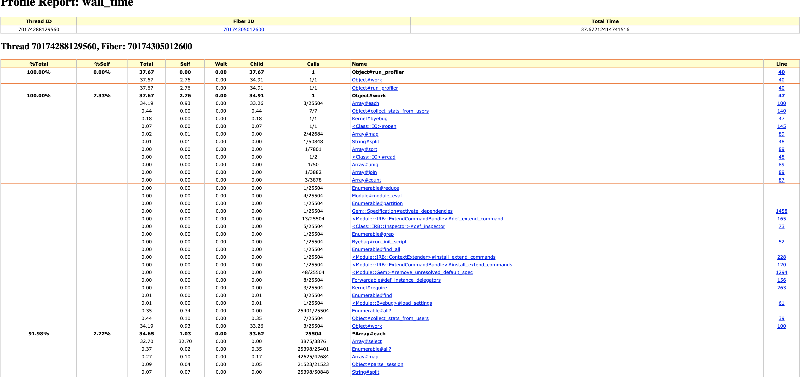
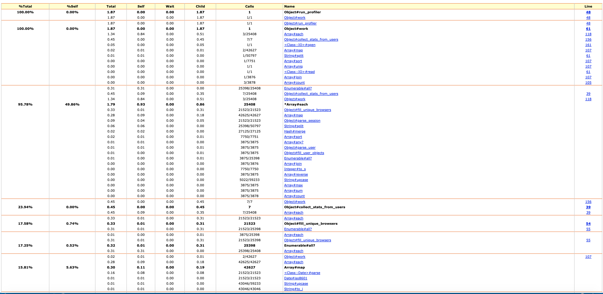
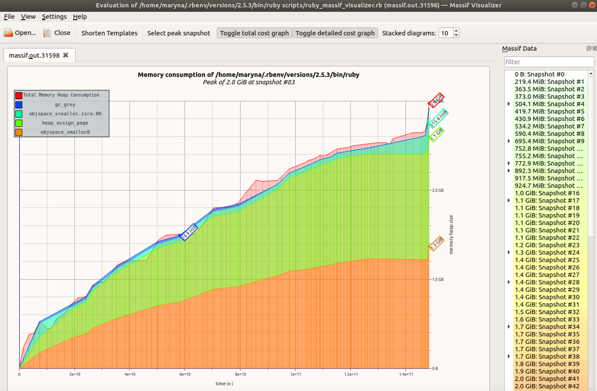

# Case-study оптимизации

# Case-study optimization

## Actual problem
Our project has a serious problem.

It was necessary to process the data file, a little more than one hundred twenty megabytes (3 million lines).

We already had a program on `ruby` that knew how to do the necessary processing.

It worked successfully on files with a size of a couple of megabytes , but for a large file it worked too long, and it wasn’t clear if it would finish the job at all in some reasonable time.

I decided to fix this problem by optimizing this program.

## Metric formation
I decided to work with 1Mb file, but also have smaller files in order to see how data volume impacts the 
time processing of each file.

## Анализ зависимости метрики от входных данных
In order to track metrics dependency on the amount of data, we will use script that checks this metrics in differents
files, where files sizes are: 0.25MB, o.5MB and 1MB.
For measuring this metric we will use `scripts/asymptotics.rb` script.

We will use benchmark and benchmark/ips

Results of these measurments for `benchmark/ips` (iterations per seconds) are the following:

```
Calculating -------------------------------------
      Process 0.25Mb      1.145  (± 0.0%) i/s -      6.000  in   5.240788s
       Process 0.5Mb      0.291  (± 0.0%) i/s -      2.000  in   6.891300s
         Process 1Mb      0.039  (± 0.0%) i/s -      1.000  in  25.659316s

Comparison:
      Process 0.25Mb:        1.1 i/s
       Process 0.5Mb:        0.3 i/s - 3.94x  slower
         Process 1Mb:        0.0 i/s - 29.38x  slower
```

As we can see from the above calculations the when we iterate the file of 0.5MB, we receive almost 4 times slower iterations per seconds metric comparing to the 0.25MB size file. Processing 1MB file is approximately 29 times slower. Therefore, we can observe that increasing file size in 2 times, will cause dramatic increase in processing time.

Results of these measurments using `Benchmark.realtime` are the following:

```
data/data_025mb.txt
Finish in 0.85
data/data_05mb.txt
Finish in 4.8
data/data_1mb.txt
Finish in 27.48
```

## Initial metrics
I decided to work with 1MB file where initial i/s is 0.039 and realtime processint is approximately 27 seconds.


## Guaranteed correct operation of an optimized program
The program was provided with the test.
Running this test will prevent changes to the program logic during optimization.

## Feedback-Loop
In order to be able to quickly test hypotheses, I built an effective feedback loop,
which allowed me to get feedback on the effectiveness of the changes made.
This is how I built feedback-loop

1. Create a relatively small file(1 MB)
2. Make a code change
3. Check if the change passes in the code
4. If the test passes, check if the metrics have metrics
5. If the test does not read, see item 1.
6. If metrics are acceptable, push to GitHub

## We delve into the details of the system to find 20% of growth points
In order to find "growth points" for optimization, I used the following tools:
- benchmark and benchmark/ips
- ruby-prof gem (`RubyProf::Flat`), `WALL_TIME` 
- ruby-prof gem (`GraphHtmlPrinter`), `WALL_TIME`
- ruby-prof gem (`RubyProf::CallStackPrinter`), `WALL_TIME`
- ruby-prof gem (`RubyProf::CallTreePrinter`), `WALL_TIME` and `Qcachegrind`
- gem ruby-progressbar
- gem rbspy

## Initial Measurements

In order to find certain problems I decided to perform initial measurements

From `RubyProf::Flat` report, we can identify 2 main problems:
```
%self      total      self      wait     child     calls  name
 94.07     29.643    29.643     0.000     0.000     3875   Array#select

  2.98     31.432     0.938     0.000    30.494    25408  *Array#each
```
 %self - The percentage of time spent in this method, derived from self_time/total_time
  total - The time spent in this method and its children.
  self  - The time spent in this method.
  wait  - amount of time this method waited for other threads
  child - The time spent in this method's children.
  calls - The number of times this method was called.
  name  - The name of the method.

We can see that `#select` method on array is calld 3875 times and time spent in this method is 29.6
On the other hand, `#each` method is called 25408 time and most of the time is spent in this method's children.

Based on the `GraphHtmlPrinter` report we observe same results, 
where starting from line 100 there is a memory consuming code:

```
users.each do |user|
  attributes = user
  user_sessions = sessions.select { |session| session['user_id'] == user['id'] }
  user_object = User.new(attributes: attributes, sessions: user_sessions)
  users_objects = users_objects + [user_object]
end
```



Based on the screenshot from `CallStackPrinter`, we can see that `select` is our method to look at


### Discovery №1
In order to retreive all sessions for user it was decided to create a `user_sessions` hash right during the reading of the file with keys equal to `user_id` and value equal to the array of sessions corresponding to each user.

```
file_lines.each do |line|
  cols = line.split(',')
  
  users << parse_user(line) if cols[0] == 'user'
  next unless cols[0] == 'session'
  session = parse_session(line) 
  sessions = sessions + [session] 
  user_sessions[session['user_id']] ||= []
  user_sessions[session['user_id']] << session
end
```

Results of these measurments for `benchmark/ips` (iterations per seconds) are the following:
```
Calculating -------------------------------------
      Process 0.25Mb      4.979  (± 0.0%) i/s -     25.000  in   5.070887s
       Process 0.5Mb      2.064  (± 0.0%) i/s -     11.000  in   5.383638s
         Process 1Mb      0.696  (± 0.0%) i/s -      4.000  in   5.755144s

Comparison:
      Process 0.25Mb:        5.0 i/s
       Process 0.5Mb:        2.1 i/s - 2.41x  slower
         Process 1Mb:        0.7 i/s - 7.15x  slower
```

Results of these measurments using `Benchmark.realtime` are the following:
```

data/data_025mb.txt
Finish in 0.2
data/data_05mb.txt
Finish in 0.51
data/data_1mb.txt
Finish in 1.62
```

Just based on the above reports we can see that processing file was much faster after this refactoring.

#### Redults from RubyProf::FlatProfiler
Main work is happening in the following methods:
- `Array#each from collect_stats_from_users`
- ` String#split` from `Object#parse_user` and `Object#parse_session`
- `Array#map` from many places in `Object#work`
- `<Class::Date>#parse`
- `Object#parse_session` where `split(',')` method is executed
- `Regexp#match`
- `Hash#to_json`
- `Hash#merge`
```
 %self      total      self      wait     child     calls  name
 50.75      1.831     0.970     0.000     0.861    25408  *Array#each
    called from:
      Object#work (txmt://open?url=file:///Users/maryna.nogtieva/learning/rails_projects/task-2/task-2.rb&line=61)
      Object#collect_stats_from_users (txmt://open?url=file:///Users/maryna.nogtieva/learning/rails_projects/task-2/task-2.rb&line=39)

  8.23      0.157     0.157     0.000     0.000    50797   String#split
    called from:
      Object#work (txmt://open?url=file:///Users/maryna.nogtieva/learning/rails_projects/task-2/task-2.rb&line=61)
      Object#parse_user (txmt://open?url=file:///Users/maryna.nogtieva/learning/rails_projects/task-2/task-2.rb&line=18)
      Object#parse_session (txmt://open?url=file:///Users/maryna.nogtieva/learning/rails_projects/task-2/task-2.rb&line=28)

  5.24      0.282     0.100     0.000     0.182    42627   Array#map
    called from:
      Object#work (txmt://open?url=file:///Users/maryna.nogtieva/learning/rails_projects/task-2/task-2.rb&line=61)

  4.04      0.152     0.077     0.000     0.075    21523   <Class::Date>#parse

  1.86      0.090     0.036     0.000     0.054    21523   Object#parse_session
    defined at:
      txmt://open?url=file:///Users/maryna.nogtieva/learning/rails_projects/task-2/task-2.rb&line=28

  1.80      0.034     0.034     0.000     0.000    43046   Regexp#match

  1.16      0.049     0.022     0.000     0.026        1   JSON::Ext::Generator::GeneratorMethods::Hash#to_json

  1.13      0.022     0.022     0.000     0.000    27125   Hash#merge
  ```


#### RubyProf::GraphHtmlPrinter
Similar results are presented from `GraphHtmlPrinter`.
It's obvious that I we need to remove the amount of `Array#each` calls.
Most time our is spent in the following methods:

```
total time  amount of calls method
0.33	      21523/21523	    Object#fill_unique_browsers	
0.28        42625/42627	    Array#map	
0.09	      21523/21523	    Object#parse_session
```


#### RubyProf::CallStackPrinter
From the screenshot below we can state that methods requiring some improvement are
- `Object#fill_unique_browsers` where we use `Enumerable#all`
- `Object#parse_session` where we use `String#split`
- `Object#collect_stats_from_users` where we user `Array#each`, `Array#map`, `<Class::Date>#parse`, `Regexp#match`


#### RubyProf::CallTreePrinter and Qcachegrind
Calltree graph below presents same information in regards to which methods have to be be refactored next: 


However, from `Callees` graph we can see that we should also pay attention to 
`sort`, `merge` and `any` methods, maybe they wiil have to be refacotred later.

### Discovery №2
О вашей находке №2

For getting unique values we can use `Set` class.
According to documentation `Set implements a collection of unordered values with no duplicates.` This help us to get rid of `#fill_unique_browsers` method where we used `Enumerable#all`. This method was called from `each loop` which is now not necessary to use.
It also helped us to get rid of som `map` methods for getting `report['allBrowsers']`

We were able to remove:
```
uniqueBrowsers = []
  sessions.each do |session|
    uniqueBrowsers = fill_unique_browsers(session, uniqueBrowsers)
  end
```

and use `Set` during reading each line of file:
```
unique_browsers = Set.new([])
browser = session['browser'].upcase!
unique_browsers.add(browser)
```

This change didn't really improve `brnchmark/ips` metrics:
```
Calculating -------------------------------------
      Process 0.25Mb      6.623  (±15.1%) i/s -     33.000  in   5.032015s
       Process 0.5Mb      2.900  (± 0.0%) i/s -     15.000  in   5.185387s
         Process 1Mb      0.739  (± 0.0%) i/s -      4.000  in   5.442805s

Comparison:
      Process 0.25Mb:        6.6 i/s
       Process 0.5Mb:        2.9 i/s - 2.28x  slower
         Process 1Mb:        0.7 i/s - 8.96x  slower
```

`Benchmark.realtime` presented the following:
```
Finish in 0.17
data/data_05mb.txt
Finish in 0.45
data/data_1mb.txt
Finish in 1.48
```

As we can see time for processing 1MB file went down from 1.62 to 1.48 only.
Therefore, this was minor improvement and we should really focus on `collect_stats_from_users` method.


#### Rbspy
Based on the fact that result are not very different I decided to check data from from additional tools like rbspy.

```
 % self  % total  name
  82.93   100.00  block in work - /Users/maryna.nogtieva/learning/rails_projects/task-2/task-2.rb
 13.41   100.00  <c function> - unknown
  3.66    10.98  parse_session - /Users/maryna.nogtieva/learning/rails_projects/task-2/task-2.rb
   0.00   100.00  work - /Users/maryna.nogtieva/learning/rails_projects/task-2/task-2.rb
  0.00   100.00  <main> - scripts/rbspy_prof.rb
```

Here is a `rbspy flamegraph` where we can observe that results do not contradict other reports. Some of the top functions being run are:
- `collect_stats_from_users` (22.3%) 
- block `file_lines` where each line of the file is being iterated and transformed (69.78%)


### Discovery №3
Next optimization I decided to do for `collect_stats_from_users` method because I identified it to be the biggest problem spot among others.
I avoided calling this method 7 times where we saw iteration inside other iteration (user object and user_sessions array)

I removed all code that called this method, for instance:
```
collect_stats_from_users(report, users_objects) do |user|
  { 'totalTime' => user_sessions[user.attributes['id']].map {|s| s['time']}.map {|t| t.to_i}.sum.to_s + ' min.' }
end
```

The refactored code looks like:
```
def collect_stats_from_users(report, users_objects, progress: false, progress_bar: nil)
  users_objects.each do |user|
    progress_bar.increment if progress
    user_key = "#{user.attributes[:first_name]}" + ' ' + "#{user.attributes[:last_name]}"
    report[:usersStats][user_key] ||= {}

    # amount of sessions by user
    report[:usersStats][user_key][:sessionsCount] = count_sessions(user)

    # amount of time by user
    report[:usersStats][user_key][:totalTime] = session_time(user)

    # the longest session per user
    report[:usersStats][user_key][:longestSession] = user_longest_session(user)

    # user's browsers
    report[:usersStats][user_key][:browsers] = user_browsers(user)

    # used IE?
    report[:usersStats][user_key][:usedIE] = used_ie?(user)

    # always use chrome?
    report[:usersStats][user_key][:alwaysUsedChrome] = always_use_chrome?(user)

    report[:usersStats][user_key][:dates] = user_sessions_dates(user)
    report[:usersStats][user_key]
  end
end
```

Other spots I refactored were :
- changing string keys in hashes to symbols
- add `start_with?` method instead of splitting columns during reading each file line.

The above optimization showed the following results:

### Benchmark
The results of `Benchmark.realtime` were as follows:

```
data/data_025mb.txt
Finish in 0.09
data/data_05mb.txt
Finish in 0.19
data/data_1mb.txt
Finish in 0.39
```

Processing 1MB file is 3.8 times faster comparing to previous optimization(1.48s)

The results of `Benchmark.ips` were as follows:

```
Calculating -------------------------------------
      Process 0.25Mb      9.853  (±20.3%) i/s -     48.000  in   5.089442s
       Process 0.5Mb      4.643  (± 0.0%) i/s -     23.000  in   5.012045s
         Process 1Mb      2.653  (± 0.0%) i/s -     14.000  in   5.286535s

Comparison:
      Process 0.25Mb:        9.9 i/s
       Process 0.5Mb:        4.6 i/s - 2.12x  slower
         Process 1Mb:        2.7 i/s - 3.71x  slower
```
As we can see from the above calculations the when we iterate the file of 0.5MB, we receive around 2 times slower iterations per seconds metric comparing to the 0.25MB size file. Processing 1MB file is approximately 3.7 times slower. 
Calculations show us great improvement of the program in terms of time processing.


#### Results from RubyProf::FlatProfiler

From `RubyProf::Flat` report, we can see that the slowest methods are:
- <Class::Date>#parse 13.97%
- Array#each 13.60% called from c`ollect_stats_from_users` method
- Array#map 12.31% called from `user_longest_session, session_time, user_browsers, always_use_chrome?, user_sessions_dates, used_ie?` methods
- String#split 7.47% called from `parse_user` and `parse_session`
- Regexp#match 5.96%
- Hash#to_json  4.23%

```

 %self      total      self      wait     child     calls  name
 13.97      0.153     0.078     0.000     0.075    21523   <Class::Date>#parse

 13.60      0.496     0.076     0.000     0.420     3879  *Array#each
    called from:
      Object#work (txmt://open?url=file:///Users/maryna.nogtieva/learning/rails_projects/task-2/task-2.rb&line=107)
      Object#collect_stats_from_users (txmt://open?url=file:///Users/maryna.nogtieva/learning/rails_projects/task-2/task-2.rb&line=42)

 12.31      0.248     0.069     0.000     0.180    42625   Array#map
    called from:
      Object#session_time (txmt://open?url=file:///Users/maryna.nogtieva/learning/rails_projects/task-2/task-2.rb&line=75)
      Object#user_longest_session (txmt://open?url=file:///Users/maryna.nogtieva/learning/rails_projects/task-2/task-2.rb&line=79)
      Object#user_browsers (txmt://open?url=file:///Users/maryna.nogtieva/learning/rails_projects/task-2/task-2.rb&line=83)
      Object#used_ie? (txmt://open?url=file:///Users/maryna.nogtieva/learning/rails_projects/task-2/task-2.rb&line=87)
      Object#always_use_chrome? (txmt://open?url=file:///Users/maryna.nogtieva/learning/rails_projects/task-2/task-2.rb&line=91)
      Object#user_sessions_dates (txmt://open?url=file:///Users/maryna.nogtieva/learning/rails_projects/task-2/task-2.rb&line=95)

  7.47      0.042     0.042     0.000     0.000    25399   String#split
    called from:
      Object#work (txmt://open?url=file:///Users/maryna.nogtieva/learning/rails_projects/task-2/task-2.rb&line=107)
      Object#parse_user (txmt://open?url=file:///Users/maryna.nogtieva/learning/rails_projects/task-2/task-2.rb&line=20)
      Object#parse_session (txmt://open?url=file:///Users/maryna.nogtieva/learning/rails_projects/task-2/task-2.rb&line=30)

  5.96      0.033     0.033     0.000     0.000    43046   Regexp#match

  4.23      0.051     0.024     0.000     0.027        1   JSON::Ext::Generator::GeneratorMethods::Hash#to_json

  4.08      0.051     0.023     0.000     0.028    21523   Object#parse_session
    defined at:
      txmt://open?url=file:///Users/maryna.nogtieva/learning/rails_projects/task-2/task-2.rb&line=30

  3.35      0.019     0.019     0.000     0.000    64154   String#encode

  2.99      0.017     0.017     0.000     0.000    21523   String#gsub!

  2.26      0.013     0.013     0.000     0.000    21523   MatchData#begin

  2.14      0.014     0.012     0.000     0.002     3875   Array#any?
    called from:
      Object#used_ie? (txmt://open?url=file:///Users/maryna.nogtieva/learning/rails_projects/task-2/task-2.rb&line=87)

  2.14      0.022     0.012     0.000     0.010     7750   Array#sort
    called from:
      Object#user_browsers (txmt://open?url=file:///Users/maryna.nogtieva/learning/rails_projects/task-2/task-2.rb&line=83)
      Object#user_sessions_dates (txmt://open?url=file:///Users/maryna.nogtieva/learning/rails_projects/task-2/task-2.rb&line=95)

  2.07      0.012     0.012     0.000     0.000    37710   String#upcase

  2.05      0.011     0.011     0.000     0.000    21523   Date#iso8601

  1.85      0.010     0.010     0.000     0.000    43978   Date#<=>
```

Based on Flat report it makes sense to pay attention to 
`map`, `split`, `match` and `to_json` methods


#### RubyProf::GraphHtmlPrinter
From `GraphHtmlPrinter` we can see that slow parts of the code ale located in:

- Array#map
- <Class::Date>#parse
- JSON::Ext::Generator::GeneratorMethods::Hash#to_json
- String#split
- Regexp#match


#### RubyProf::CallStackPrinter
From the screenshot below we can see similar results. The slowest execution paths are in `user_sessions_dates` (`map`, `match` methods) as well as other `map` methods that are called during each `user_object` iteration.


#### RubyProf::CallTreePrinter and Qcachegrind

From the graph below we can come to the same conclusion that a lot of time program spends in `user_sessions_dates` method


#### Rbspy

After profiling program with rbspy I noticed that it's quite hard to read the flamegraph report.
However, I was able to identify that around 55% were allocated in `collect_stats_from_users` method which in its turn consisted of 28% from `user_sessions_dates` method.

[rbspy report](screenshots/rbspy-2019-03-25-xpqUSwn2Ni.flamegraph.svg)


#### Ruby-ProgressBar
Once I saw that overall result of processing file was improved, at least time wise, I decided to run progressbar by using `ruby-progressbar` gem. When deciding on how and where to use it it made the most sense to check the processing of `user_obects` for the whole 128MB file. 
As per the screenshot below it's notable that that process would take around 50seconds for the whole file.
I found it hard to decide in what place to use progress bar and I think this might require more experiments. Ideally it would be great to see progress bar in each method/block of code that one is interested in.


## Discovery 4

As per requirements we did not have to parse date because we already had same format in.

```
 user.sessions[user.attributes[:id]].map{|s| s[:date]}.map {|d| Date.parse(d)}.sort.reverse.map { |d| d.iso8601 }
```

THrefore, this function can be refactored to:

```
user.sessions[user.attributes[:id]].map!{|s| s[:date]}.sort!.reverse!
```

If incoming format will change, it would be necessary to find another more efficient way to parse Date. In task one I used the following approach, although I feel it could be improved
```
user.sessions.sort_by!{ |s| s[:date] }.reverse!.map!{ |s| Date.iso8601(s[:date]) } 
```

Replaced REGEX:
```
b.upcase =~ /CHROME/

```
with
```
b.include?(CHROME) #CHROME is a Constant
```

Also used `oj` gem to parse json based on this comparison gist I found https://gist.github.com/aishfenton/480059. 
Oj gem seemed reasonable to try.
And I think it's proved to be efficient.

### Benchmark

The results of Benchmark.realtime were as follows:

```
data/data_025mb.txt
Finish in 0.04
data/data_05mb.txt
Finish in 0.1
data/data_1mb.txt
Finish in 0.18
```
Processing 1MB file is 2 times faster comparing to previous optimization(0.39s)

The results of Benchmark.ips were as follows:
```
Calculating -------------------------------------
      Process 0.25Mb     27.088  (±11.1%) i/s -    135.000  in   5.030179s
       Process 0.5Mb     10.326  (± 9.7%) i/s -     52.000  in   5.064479s
         Process 1Mb      5.973  (± 0.0%) i/s -     30.000  in   5.040117s

Comparison:
      Process 0.25Mb:       27.1 i/s
       Process 0.5Mb:       10.3 i/s - 2.62x  slower
         Process 1Mb:        6.0 i/s - 4.53x  slower
```


As we can see from the above calculations the when we iterate the file of 0.5MB, we receive around 2.6 times slower iterations per seconds metric comparing to the 0.25MB size file. Processing 1MB file is approximately 4.5 times slower. Although the comparison numbers do not seem better at first sight, the amount of iterations per second increased comparing with previous results:
- from 9.853 to 27.088 for 0.25Mb file
- from 4.643 to 10.326 for 0.5Mb file
- from 2.653 to 5.973 for 1Mb file

### Results from RubyProf::FlatProfiler

From RubyProf::Flat report, we can see that the slowest methods are:

- Array#each  23.50% called from collect_stats_from_users method
- String#split  16.45% called from parse_user and parse_session
- Object#parse_session  8.74%
- Array#map  8.53% called from user_browsers, used_ie?, always_use_chrome? methods
- <Module::Oj>#dump  8.43%
- Hash#to_json 4.23%

```
%self      total      self      wait     child     calls  name
 23.50      0.265     0.070     0.000     0.194     3879  *Array#each
    called from:
      Object#work (txmt://open?url=file:///Users/maryna.nogtieva/learning/rails_projects/task-2/task-2.rb&line=113)
      Object#collect_stats_from_users (txmt://open?url=file:///Users/maryna.nogtieva/learning/rails_projects/task-2/task-2.rb&line=47)

 16.45      0.049     0.049     0.000     0.000    25399   String#split
    called from:
      Object#work (txmt://open?url=file:///Users/maryna.nogtieva/learning/rails_projects/task-2/task-2.rb&line=113)
      Object#parse_user (txmt://open?url=file:///Users/maryna.nogtieva/learning/rails_projects/task-2/task-2.rb&line=26)
      Object#parse_session (txmt://open?url=file:///Users/maryna.nogtieva/learning/rails_projects/task-2/task-2.rb&line=36)

  8.74      0.062     0.026     0.000     0.036    21523   Object#parse_session
    defined at:
      txmt://open?url=file:///Users/maryna.nogtieva/learning/rails_projects/task-2/task-2.rb&line=36

  8.53      0.029     0.025     0.000     0.004    15500   Array#map
    called from:
      Object#user_browsers (txmt://open?url=file:///Users/maryna.nogtieva/learning/rails_projects/task-2/task-2.rb&line=89)
      Object#used_ie? (txmt://open?url=file:///Users/maryna.nogtieva/learning/rails_projects/task-2/task-2.rb&line=93)
      Object#always_use_chrome? (txmt://open?url=file:///Users/maryna.nogtieva/learning/rails_projects/task-2/task-2.rb&line=97)

  8.43      0.025     0.025     0.000     0.000        1   <Module::Oj>#dump

  3.42      0.010     0.010     0.000     0.000    21523   Set#add
    defined at:
      txmt://open?url=file:///Users/maryna.nogtieva/.rbenv/versions/2.5.3/lib/ruby/2.5.0/set.rb&line=349

  3.06      0.009     0.009     0.000     0.000    50796   String#start_with?

  2.17      0.011     0.006     0.000     0.004     3875   Object#session_time
    defined at:
      txmt://open?url=file:///Users/maryna.nogtieva/learning/rails_projects/task-2/task-2.rb&line=81

  1.60      0.005     0.005     0.000     0.000     3875   Array#map!
    called from:
      Object#user_sessions_dates (txmt://open?url=file:///Users/maryna.nogtieva/learning/rails_projects/task-2/task-2.rb&line=101)

  1.51      0.015     0.004     0.000     0.010     3875   Object#parse_user
    defined at:
      txmt://open?url=file:///Users/maryna.nogtieva/learning/rails_projects/task-2/task-2.rb&line=26

  1.49      0.004     0.004     0.000     0.000     3875   User#initialize
    defined at:
      txmt://open?url=file:///Users/maryna.nogtieva/learning/rails_projects/task-2/task-2.rb&line=15

  1.47      0.004     0.004     0.000     0.000     3875   Array#sort
    called from:
      Object#user_browsers (txmt://open?url=file:///Users/maryna.nogtieva/learning/rails_projects/task-2/task-2.rb&line=89)

  1.47      0.004     0.004     0.000     0.000     7750   Integer#to_s
    called from:
      Object#session_time (txmt://open?url=file:///Users/maryna.nogtieva/learning/rails_projects/task-2/task-2.rb&line=81)
      Object#user_longest_session (txmt://open?url=file:///Users/maryna.nogtieva/learning/rails_projects/task-2/task-2.rb&line=85)

  1.34      0.004     0.004     0.000     0.000    21523   String#upcase!
    called from:
      Object#parse_session (txmt://open?url=file:///Users/maryna.nogtieva/learning/rails_projects/task-2/task-2.rb&line=36)

  1.32      0.004     0.004     0.000     0.000     3876   Array#join
    called from:
      Object#work (txmt://open?url=file:///Users/maryna.nogtieva/learning/rails_projects/task-2/task-2.rb&line=113)
      Object#user_browsers (txmt://open?url=file:///Users/maryna.nogtieva/learning/rails_projects/task-2/task-2.rb&line=89)

  1.31      0.004     0.004     0.000     0.000    21523   String#to_i

  1.25      0.004     0.004     0.000     0.000    16187   String#include?

  1.22      0.004     0.004     0.000     0.000     3875   Array#sort!
    called from:
      Object#user_sessions_dates (txmt://open?url=file:///Users/maryna.nogtieva/learning/rails_projects/task-2/task-2.rb&line=101)

  1.20      0.011     0.004     0.000     0.008     3875   Object#fill_user_objects
    defined at:
      txmt://open?url=file:///Users/maryna.nogtieva/learning/rails_projects/task-2/task-2.rb&line=105
```


### RubyProf::GraphHtmlPrinter
From GraphHtmlPrinter we can see that slow parts of the code are located in:
- `#collect_stats_from_users` the percentage of time in this method reduced from 65.24% to 36.87% comparing to the previous optimization.
- `#parse_session` the percentage increased from 9.79% to 19.54%
- `String#split` takes 14.65%
- `Array#map` percentage was reduced from 46.39% to 10.54%


### RubyProf::CallStackPrinter
From the screenshot below we can see similar results. The slowest execution paths are in the following methods:
- `parse_sessions` where (`String#split`) is used
- `collect_stats_from_users ` where we use `Object#user_browsers` with `sort, map and join`, `Object#used_ie?` with `any? and map` methods.


### RubyProf::CallTreePrinter and Qcachegrind
From the graph below we can come to the same conclusion that inside `Array#each` most of the methods are equally divided in terms of time
processing except `#parse_session` method which takes around 21%


### Ruby-ProgressBar

As per the screenshot below it's notable that that process would take around 11 seconds for the whole file. This is huge improvement comparing to 50 seconds from previous optimization.

### Valgrind Massif & Massif Visualizer

From the graph we can see linear growth of memoty consumption.
Half of it is allocated for `objspace` and `heap_assign_page`



## Results
As a result of this optimization, we finally managed to process the data file.
It was possible to improve the system metric and run 1Mb-sized file in 0.18 seconds and 128Mb-sized file in 11 seconds

## Protection against performance regression

I added minitest to check that processing time of 1Mb file would not exceed 0.3 seconds
```
time = Benchmark.realtime { work('data/data_1mb.txt', 'data/test_data/outcome_time') }
assert(time.round(2) <= 0.3)
```