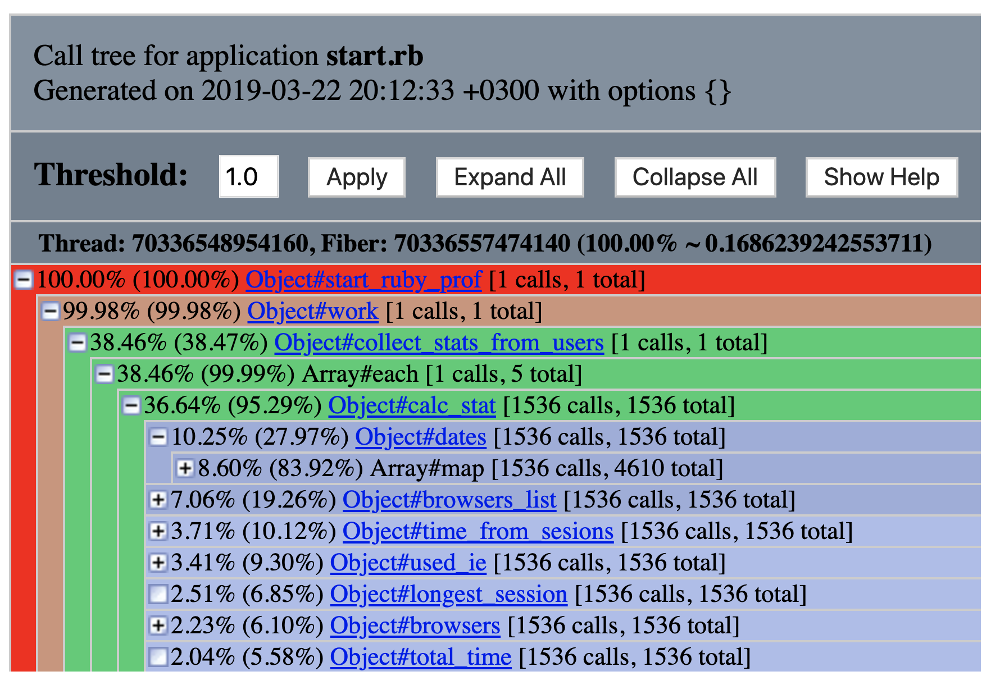

# Case-study Задание №2

### Построить и проанализировать отчёт ruby-prof в режиме Flat
Проанализируем этим отчетом затрачиваемое время выполнения (режим wall_time)
```
Measure Mode: wall_time
Thread ID: 70208069025840
Fiber ID: 70208065413220
Total: 0.161745
Sort by: self_time

 %self      total      self      wait     child     calls  name
 19.77      0.032     0.032     0.000     0.000    20000   String#split
 16.45      0.125     0.027     0.000     0.098        5   Array#each
```
Из отчета видно, что больше всего времени мы тратим на разбиение строк(`String#split`) именно эта функция первый кандидат на улучшение, если нам не будет хватать скорости обработки. Как вариант можно попробовать заменить связку `File.readlines` + `split` на парсинг `CSV`

Следующий "пожиратель" скорости это `Array#each`, который занимает 16.45% времени выполнения, но при этом вызывается всего 5 раз. Как вариант оптимизации, можно попробовать сократить один вызов `each` за счет отказа от отдельного прохода для выборки пользователей в масcив `users`, а потом обход `users` для создания `user_object`

[Полный текст отчета ](./tools/reports/ruby_prof_flat_allocations_profile.txt)


### Построить и проанализировать отчёт ruby-prof в режиме Graph
Проанализируем этим отчетом потребление процессора (режим cpu_time)


В этом отчете первый кандидат на улучшение `Array#each` 80.94% в колонке %Total. Но 16.37% в колонке %Self подсказывают, что большую часть времени происходит ожидание других методов, из которых самый ресурсоемкий это `String#split` 20.73%

[Полный текст отчета ](./tools/reports/ruby_prof_graph_allocations_profile.html)

### Построить и проанализировать отчёт ruby-prof в режиме CallStack
Еще раз проанализируем этим отчетом затрачиваемое время выполнения (режим wall_time)



А из этого отчета, получается, что самый долгий метод это `collect_stats_from_users`, что идет в разрез с выводами из отчета 1!

[Полный текст отчета ](./tools/reports/ruby_prof_stack_printer_allocations_profile.html)

### Построить и проанализировать отчёт ruby-prof в режиме CallTree c визуализацией в QCachegrind
Еще раз проанализируем этим отчетом затрачиваемое время выполнения (режим wall_time)


А из этого отчета, получается, что самый долгий метод это `parse_file` и дальше цепочка замедляющих его вызовов выглядит как `Array#each` -> `calc_stat `


[Сырые данные отчета ](./tools/reports/profile.callgrind.out.59260)


### Профилировать работающий процесс rbspy

### Построить и проанализировать отчёт flamegraph с помощью rbspy

### Добавить в программу ProgressBar

### Научиться пользоваться Valgrind massif с massif-visualizer. Построить профиль использования памяти для итоговой версии вашей программы и добавить скриншот в PR
