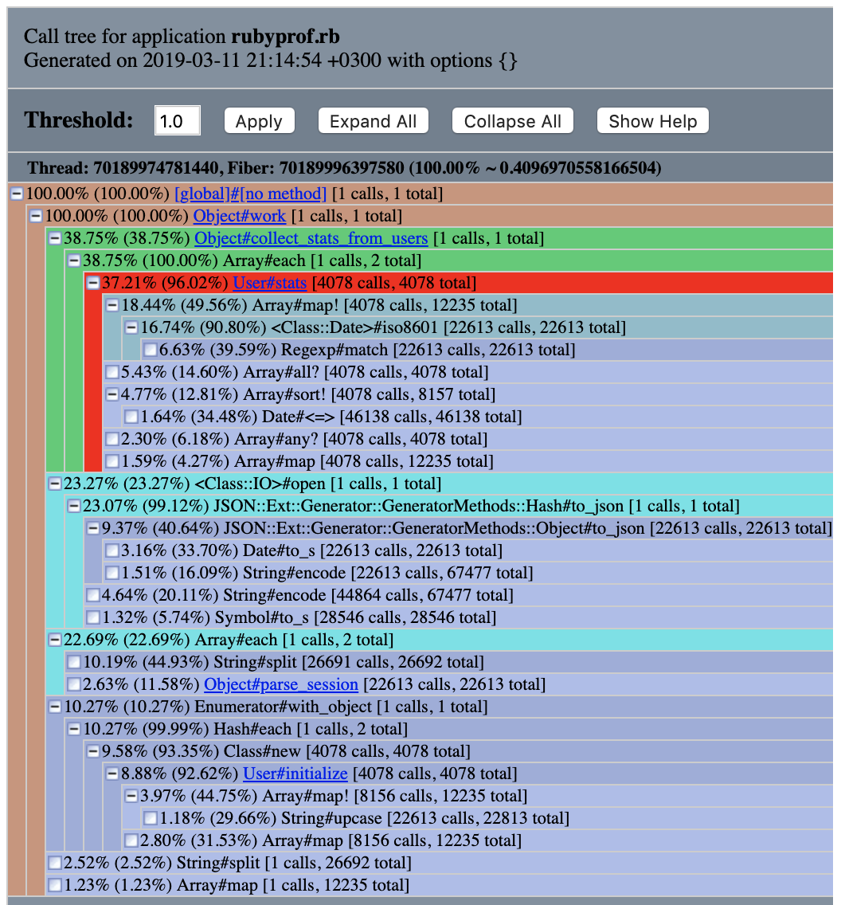

# Case-study оптимизации

## Актуальная проблема
В нашем проекте возникла серьёзная проблема.

Необходимо было обработать файл с данными, чуть больше ста мегабайт.

У нас уже была программа на `ruby`, которая умела делать нужную обработку.

Она успешно работала на файлах размером пару мегабайт, но для большого файла она работала слишком долго, и не было понятно, закончит ли она вообще работу за какое-то разумное время.

Я решил исправить эту проблему, оптимизировав эту программу.

## Формирование метрики
Для того, чтобы понимать, дают ли мои изменения положительный эффект на быстродействие программы я придумал использовать такую метрику: *Количество итераций в секунду (ips) работы программы на тестовых данных (размером 1Mb)*

## Гарантия корректности работы оптимизированной программы
Программа поставлялась с тестом. Выполнение этого теста позволяет не допустить изменения логики программы при оптимизации.

## Feedback-Loop
Для того, чтобы иметь возможность быстро проверять гипотезы я выстроил эффективный `feedback-loop`, который позволил мне получать обратную связь по эффективности сделанных изменений примерно за *5 сек.*

Вот как я построил `feedback_loop`:

Выделил в отдельный файл 1М данных из исходного файла.

Написал отдельный скрипт `feedback-loop.rb`, который проверяет:
- прохождение теста
- выполняет замер метрики

Используя его я могу быстро протестировать гипотезы и понимать их влияние на целевую метрику. При этом выполнение теста защищаем меня от случайной регресии функциональности системы на каждом шаге.

## Фиксируем исходное состоние системы
Исходная программа имеет **~3.268 ips**, время работы составило **~5,2 сек.**

## Вникаем в детали системы, чтобы найти 20% точек роста

### Valgrind ###
Зафиксируем размер потребляемой памяти работы программы на тестовых данных.
Пиковое значение составило 91МБ


### Ruby-prof ###
Сформировал отчет `ruby-prof` с измерением `WALL_TIME`в режиме Flat. Видно, что больше всего процессорного времени забирает метод массива `each`.
```
 %self      total      self      wait     child     calls  name
 14.50      0.964     0.242     0.000     0.723        2   Array#each
  8.38      0.415     0.140     0.000     0.275        1   JSON::Ext::Generator::GeneratorMethods::Hash#to_json
  7.44      0.124     0.124     0.000     0.000    12235   Array#map
  6.87      0.165     0.114     0.000     0.051     8157   Array#sort!
  6.86      0.354     0.114     0.000     0.239    12235   Array#map!
  6.72      0.189     0.112     0.000     0.077    22613   <Class::Date>#iso8601
  6.09      0.101     0.101     0.000     0.000    67477   String#encode
  5.49      0.160     0.091     0.000     0.068    22613   JSON::Ext::Generator::GeneratorMethods::Object#to_json
```
При этом значительную часть времени занимают дочерние методы **0.723** от общего **0.964**. В режиме CallStack можно наблюдать неоптимальную ветвь.


Вот какие проблемы удалось найти и решить

## 1. iso8601
Метод iso8601 по капотом которого находится регулярка забирает значительный процент ресурса процессора. Вынес его в отдельный метод и переписал

```ruby
def convert_date(date)
  Date.new(*date.split('-').map!(&:to_i)).iso8601
end
```
```ruby
 dates: sessions.map { |s| s[:date] }.map! { |d| convert_date(d) }.sort! { |x, y| y <=> x }
```
в результате ips существенно увеличилось до **6,75** время выполения программы составило **~5 сек**

В целом считаю преобразование в iso8601 лишней операцией, т.к. дата в исходных данных, уже в формате iso8601.
Если убрать это лишнее преобразование получим прирост до **8,5 ips** за то же время работы программы в 5 сек.

##

## Результаты
В результате проделанной оптимизации наконец удалось обработать файл с данными.
Удалось улучшить метрику системы с **~3.268 ips до **
Время выполнения программы с тестовыми данными составило  сек.
Время работы программы с реальными данными составило  сек

Регулярки зло

## Защита от регресса производительности
Для защиты от потери достигнутого прогресса при дальнейших изменениях программы написан performance тест
